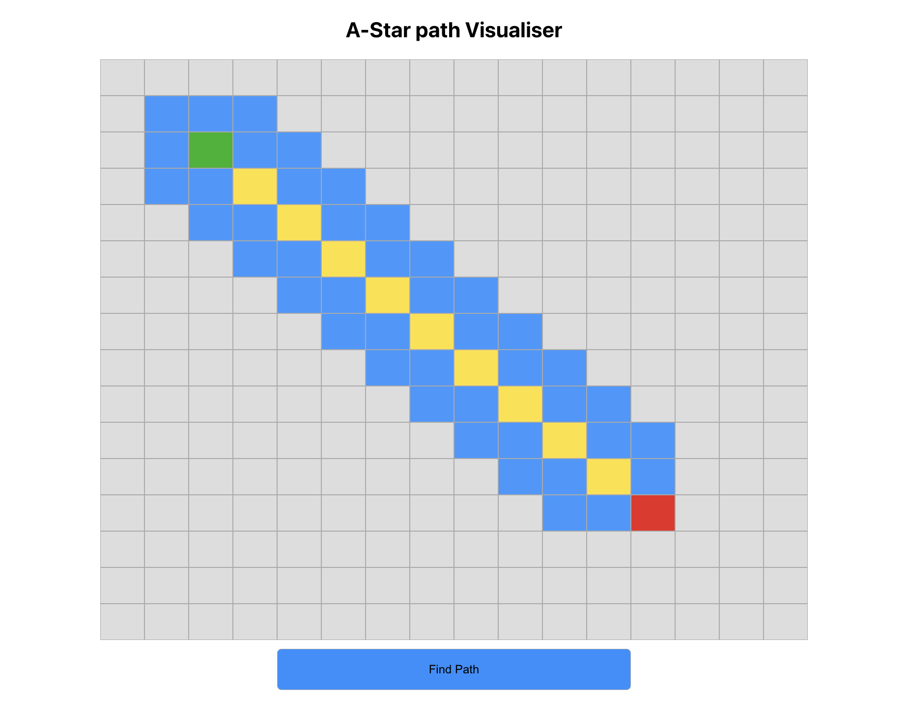

# Overview

This project contains a Java implementation of A\* (A star) search algorithm that is widely used in path finding and graph traversal.

## Tech Stack

- React.js
- Spring Boot

## Pathfinding Algorithm

A\* algorithm

## Frontend

The frontend of the project is implemented using React. It provides a user interface where users can select a starting point and an ending point on a grid. The UI then displays the shortest path between the selected points, which is obtained from the backend.

## Backend

The backend of the project is implemented using Java with Spring Boot. It serves as a REST API and provides two main endpoints.

- <strong>Endpoint 1</strong>: This endpoint is responsible for storing the values of the start and end points selected by the user. It receives the coordinates of the start and end points and stores them for further processing.

- <strong>Endpoint 2</strong>: This endpoint is responsible for sending the coordinates of the next node in the shortest path. It receives a request from the frontend and retrieves the coordinates of the next node to be displayed on the UI.

## Screenshot

